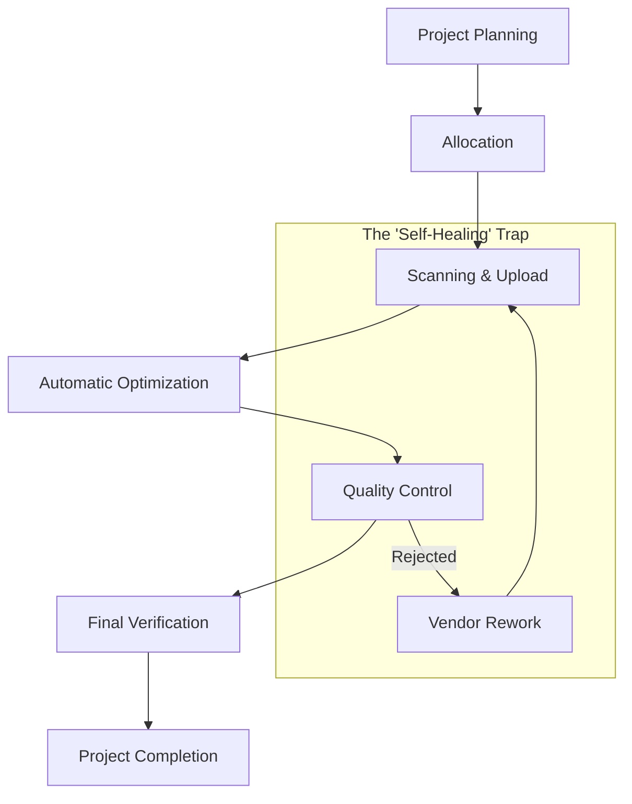

# QC Tool: Project Workflow Guide

This document provides a non-technical overview of the entire digitization and quality control lifecycle. It describes how work flows from a physical book to a verified digital asset.

## 1. High-Level Project Lifecycle

---

## 2. Role-Based Operations

### 👑 Super Admin (The System Architect)
The Super Admin oversees the entire system and ensures the infrastructure is healthy.
*   **System Setup**: Creates the global structure (Projects, Sources, Locations).
*   **User Management**: Creates accounts for Supervisors and Vendors.
*   **Global Audit**: Monitors the progress of all projects simultaneously.
*   **Maintenance**: Can trigger "Self-Healing" tools from Settings to fix any system-wide image issues.

### 📋 Upload Supervisor (The Project Manager)
The Upload Supervisor manages the "Inventory" and decides who works on what.
*   **Inventory Entry**: Registers Record Owners and Record Types (The "Master List").
*   **Vendor Allocation**: Assigns specific Books or Record types to a Vendor.
*   **Target Setting**: Defines how many images are expected for each assignment.

### 🏢 Vendor (The Production Manager)
The Vendor is the company responsible for the actual scanning work.
*   **Team Management**: Creates and manages their own Scanning Operators.
*   **Resource Mapping**: Takes the "Project Hub" assigned by the Supervisor and splits it among their operators.
*   **Live Monitoring**: Watches the Vendor Dashboard to see real-time progress.
*   **Rework Coordination**: If a batch is rejected by QC, the Vendor re-assigns it to an operator for correction.

### 📸 Scanning Operator (The Digitizer)
The Operator performs the most critical manual task: turning physical pages into digital files.
*   **Batch Creation**: Starts a new "Job" for a specific book.
*   **Physical Upload**: Uploads high-quality TIFF/RAW images directly from the scanner.
*   **Status Tracking**: Can see if their images were successfully "Converted" for QC.
*   **PWA Usage**: Can use the tool on a Tablet or Phone for easier management on the scan-floor.

### 🛡️ QC Supervisor (The Quality Head)
The QC Supervisor ensures that the final output meets the project's standards.
*   **Task Assignment**: Assigns uploaded batches to QC Users (Auditors).
*   **Final Verification**: Performs a "Second Look" at rejected or completed batches to finalize the decision.
*   **Workload Balance**: Ensures no single Auditor is overwhelmed.

### 👁️ QC User (The Auditor)
The QC User performs the visual inspection of every single image.
*   **Virtual Workbench**: Browses through images in a fast, optimized viewer.
*   **Decision Making**: Marks images as **Accepted**, **Rejected**, or **Flagged** (for rotation/crop issues).
*   **Remarks**: Adds notes on why a page was rejected (e.g., "Blurry," "Missing Corner").

---

## 3. The "Invisible" Image Engine
Behind the scenes, the system performs a complex operation every time a page is scanned:

1.  **Direct-to-Cloud**: Images go straight to secure storage (S3).
2.  **Instant Optimization**: As soon as a heavy TIFF file arrives, an "Automatic Robot" (DO Serverless Function) wakes up.
3.  **JPEG Generation**: It creates a lightweight, high-quality JPEG for the Auditors to look at, so the website stays fast.
4.  **Database Sync**: It updates the "Live Feed" so everyone from the Operator to the Super Admin knows exactly where that image is.

---

## 4. How Rework is Handled
If an image is "Bad," the following happens:
1.  **QC User** clicks "Reject" and adds a remark.
2.  **QC Supervisor** verifies the rejection.
3.  **Vendor** sees a red "Alert" on their dashboard.
4.  **Operator** gets the "Rework Notification," re-scans the page, and uploads it.
5.  **Dashboard** automatically adjusts the progress bar to reflect that the mistake has been fixed.

---

## 5. Offline Capabilities (PWA)
If the internet goes out on the scan-floor:
*   Operators can still browse their assigned tasks.
*   The system creates a "Sync Queue."
*   As soon as the internet returns, all pending statuses and minor updates are pushed to the cloud automatically.
